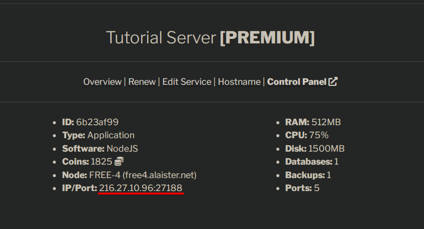
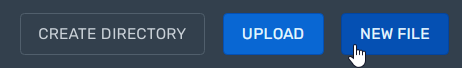
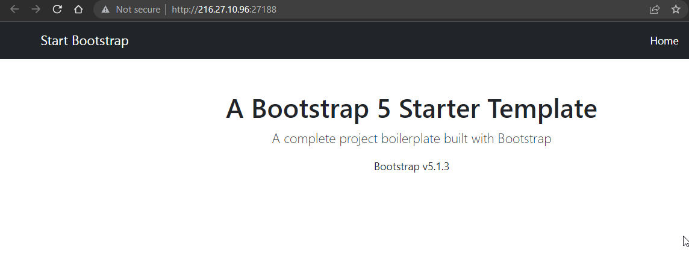

## Check your server's IP and port number
Visit the [client portal](https://client.alaister.net/account/services/){:target="_blank"}. On the `My Services` page, click your server name to view its IP and port. We'll use them later.



## Create a JS file
Next, in the [control panel](https://panel.alaister.net){:target="_blank"}, click the `Files` tab and `New File`.



Copy and paste the codes below. **Replace the port number with your server's port.**

```js
const express = require('express')
const app = express()
const port = 27188 // REPLACE THE PORT!!

app.use(express.static('public'))

app.listen(port, '0.0.0.0', () => {
  console.log(`Express listening on port ${port}`)
})
```

!!! note
    If you are a beginner to Express, learn more about it at their [official docs](https://expressjs.com/en/starter/hello-world.html){:target="_blank"}.

After that, click `Create File` and set the filename to `index.js`.

## Install Express
Start the server and enable the [Shell Access Mode](../panel/shell-access.md){:target="_blank"}.
<video width="640" height="480" controls><source src="/assets/panel/express_1.mp4" type="video/mp4"></video>

Run this command to install Express:
```sh
npm i express
```

## Download a Bootstrap 5 website template
<video width="640" height="480" controls><source src="/assets/panel/express_2.mp4" type="video/mp4"></video>
In the Shell Access Mode, run the following commands:

```sh
wget -nv -O website.zip https://github.com/startbootstrap/startbootstrap-bare/archive/gh-pages.zip
mkdir -p public
unzip -q website.zip -d ./public
mv ./public/startbootstrap-bare-gh-pages/* ./public
rmdir ./public/startbootstrap-bare-gh-pages
```

Now, you can exit shell access. Your web app will start automatically.

## Visit the website
Once your express app is online, you can visit your website with the **IP and port number** you saw in the client portal (e.g. `216.27.10.96:27188`) in your browser. **Do not use our node hostname** (e.g. `free4.alaister.net:27188`), otherwise you will see an SSL error.



Done! You have now created a static site.

## Configure custom domain and HTTPS (recommended)
Please read our [custom domain guide](../portal/hostname.md).
