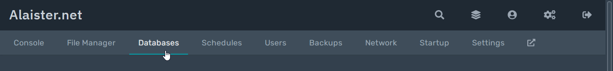
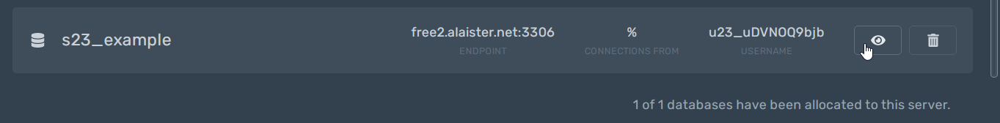
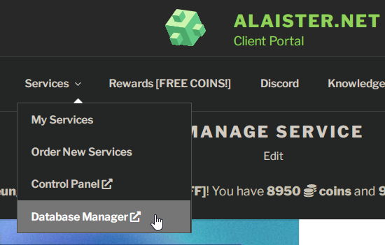
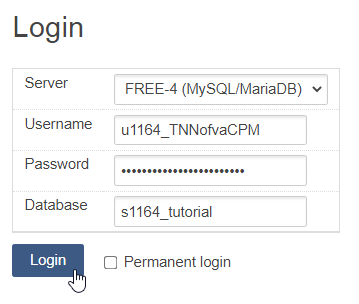
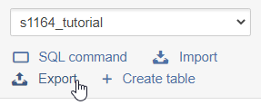
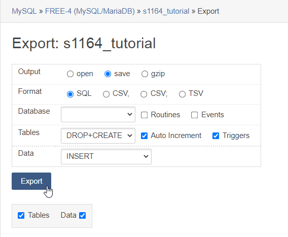

## Find your database connection details
First, access the [control panel](https://panel.alaister.net){:target="_blank"}.

Then, click the `Databases` tab.

Click the eye button of the database. You'll be able to see the database connection details.

## Back up your database
Open [Adminer database manager](https://client.alaister.net/adminer/){:target="_blank"}.

Copy and paste the username, password, and name of the database, and choose the database server depending on the node. Then click `Login`.

Click `Export` at the sidebar. 

Then export and download the **SQL** file. You may enable gzip if your database is big, but it takes more time to (un)archive during the backup process.

You've successfully backed up your database tables.

## Restore your database
Click `Import` at the sidebar. Upload the SQL file tou have downloaded. The time it takes depends on how big the database is.

Done! You have successfully restored your database.
