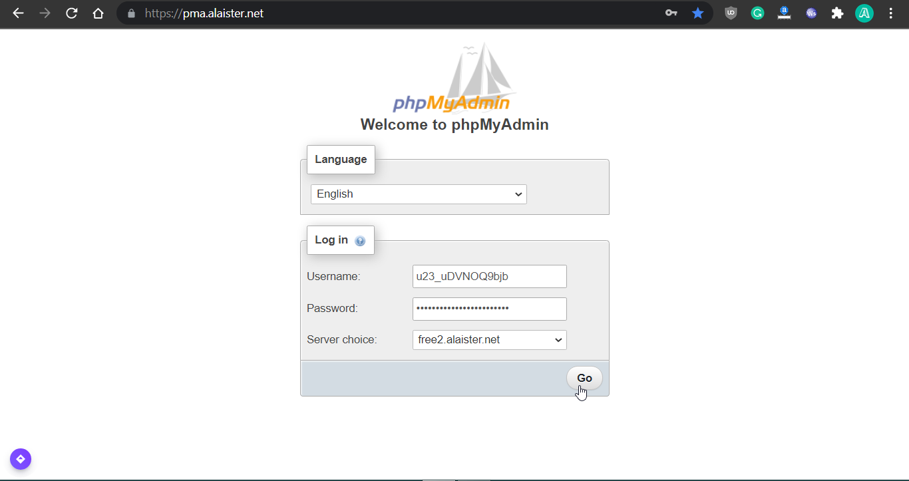
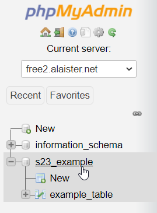
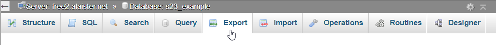
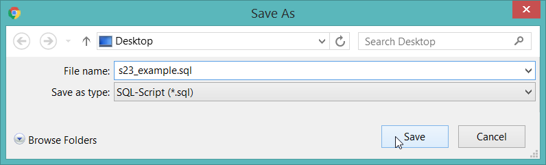
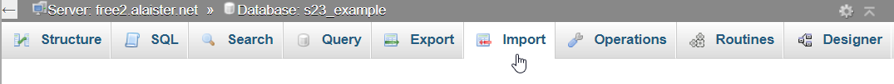
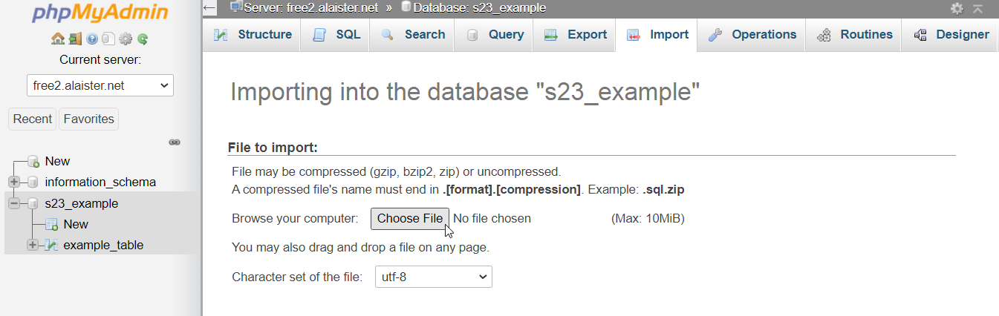
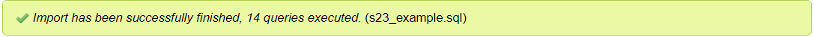

## Find your database connection details
First, log into the [game panel](https://panel.alaister.net){:target="_blank"}.

Then, click the server > `Databases`

Click the eye button of the database. You'll be able to see the database connection details.

## Back up your database
In another browser tab, open [phpMyAdmin](https://pma.alaister.net){:target="_blank"}. Copy and paste the username and password of the database and choose the database server. Then click `Go`.

Click the database > `Export` > `Go` > Save the downloaded file

You've successfully backed up your database tables.

## Restore your database
Click `Import` > Upload the .sql backup file > `Go`. The time taken depends on how many tables and rows in your backed up database.

Done! You have successfully restored your database.
