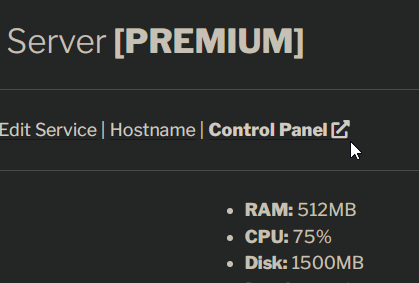
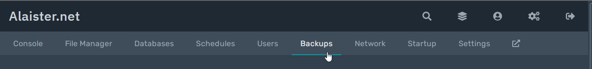
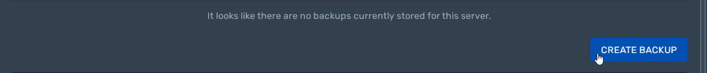
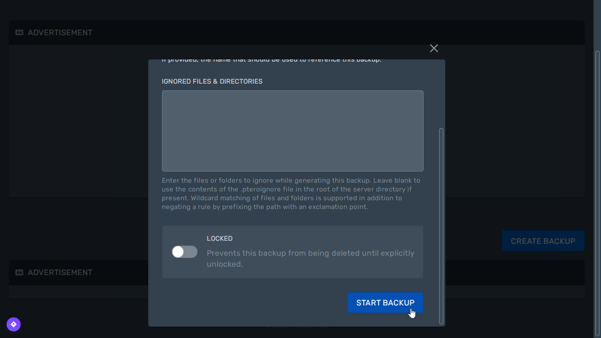
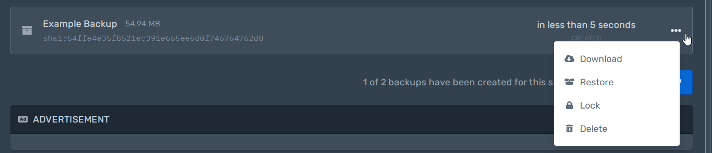

## Create a backup
First, access the [control panel](https://panel.alaister.net){:target="_blank"}.

Then, click the `Backups` tab to get started.

!!! note
    A backup usually takes around a few seconds up to 10 minutes, depending on your server size.

## Manage the backup
Finally, you can download, restore, lock, or delete the backup.

