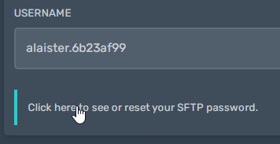
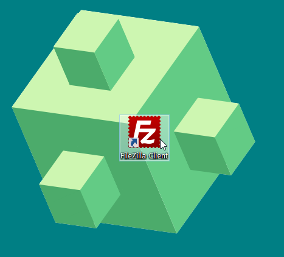

## Download an SFTP client
[FileZilla](https://filezilla-project.org/download.php?type=client){:target="_blank"} is supported on Windows, MacOS, and Linux.

## Get SFTP connection details
First, access the [control panel](https://panel.alaister.net){:target="_blank"}.

Then, click the `Settings` tab.

Next, copy your SFTP username and password.

## Connect to the SFTP server
After that, copy and paste the details to your SFTP client (i.e. FileZilla).

Done! You have successfully connected to the SFTP server. You can now upload and download multiple files and folders.

