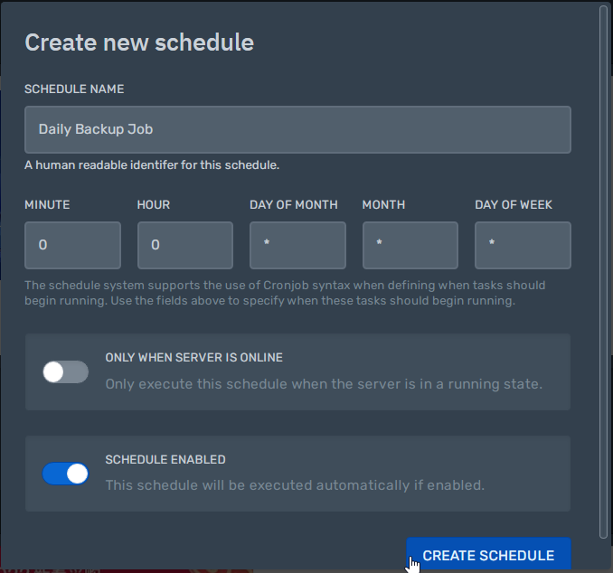

## Create a schedule
First, access the [control panel](https://panel.alaister.net){:target="_blank"}.

Then, click the `Schedules` tab.

Click `Create Schedule` to get started.

In this example, we will add a cron job that back ups the server daily (i.e. `0 0 * * *`).

!!! tip
    You can learn more about cron syntax [here](https://crontab.guru){:target="_blank"}.

Click `New Task` to create a task.

Done! Your cron job will run automatically according to your defined schedule.
