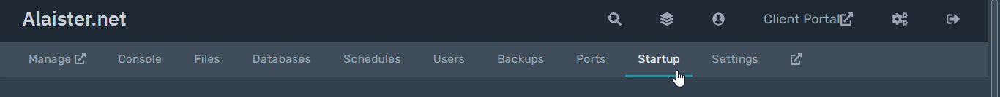

## Enable Shell Access Mode
First, access the [control panel](https://panel.alaister.net){:target="_blank"}.

Start or restart your server.

Look at the console. When you are prompted, type `yes` and press ++enter++.

??? info "How to skip the prompt when restarting my server?"
    You can hide this prompt from every server restart by changing the option in the `Startup` tab.

    

    

You can now run shell commands like `npm install discord.js`.

To exit and start your server normally, type `exit` and press ++enter++.

!!! failure
    You should not run long-running commands, start background processes, or use terminal text editor in the Shell Access Mode.
