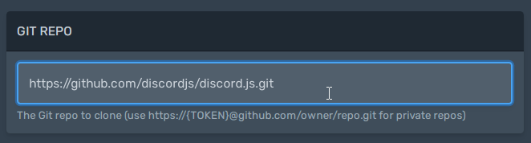
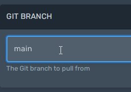
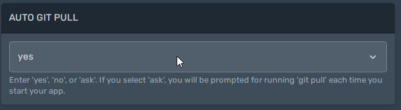

## Set your Git repository
First, access the [control panel](https://panel.alaister.net){:target="_blank"}.

Then, click the `Startup` tab.

Next, enter your Git repo URL and Git branch name:

??? info "How to clone a private repo?"
    If you don't have a GitHub PAT, generate one [here](https://github.com/settings/tokens){:target="_blank"}.

    

Restart your server to clone or pull from the Git repo. **If this is the first time you clone, all existing files on your server will be deleted.** This is required by Git and you cannot avoid it.

To automatically pull from your repo on every server restart, edit the startup option:

