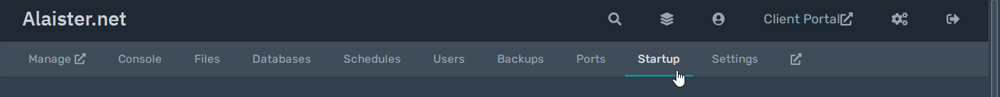
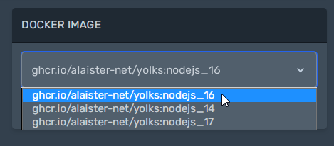

## Change the default Docker Image
First, access the [control panel](https://panel.alaister.net){:target="_blank"}.

Then, click the `Startup` tab.

Choose a Docker image from the dropdown list. In the screenshot below, there are NodeJS 14, 16, and 17.

Restart your server to see the changes.
