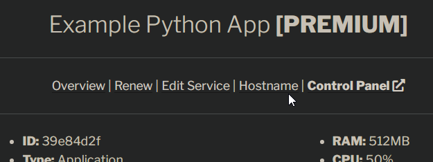

## Update DNS records
In this tutorial, we will use `www.alaister.gq` as an example.

First, point a CNAME record to `freeX.alaister.net` (e.g. `free4.alaister.net` if your server is on the FREE-4 node). The A record below is optional (but read below).

??? question "Is the A record necessary?"
    If you're adding a subdomain like `app.alaister.gq`, a CNAME record is recommended and simpler to set up.

    If you're adding a bare domain name like `alaister.gq`, you need to add an A record that points to our node's IP address.

    **The following only works for Cloudflare users.** To redirect your custom domain from www to non-www, or from non-www to www, you can create a page rule in the Cloudflare dashboard.

??? warning "Cloudflare users: orange- or gray-clouded?"
    If you want to use Cloudflare's free SSL, set the proxy status to **orange**, SSL to **flexible**, and **disable HTTPS frontend** in the next step.

    If you want to use our free SSL service, set the proxy status to **gray** and **enable HTTPS frontend** in the next step.

## Add your custom domain
Next, go back to the [client portal](https://client.alaister.net/account/services/){:target="_blank"}. On the `My Services` page, click your server name to edit its settings.

Then, click `Hostname`.

Enter your custom domain. The default HTTPS configurations are suitable for most users. Change them to fit your need.

Once you see a successful message, you can visit your new domain with HTTPS enabled in your browser. **Make sure your web app is online and listening to the correct port number, otherwise you will see a 502 error!**

