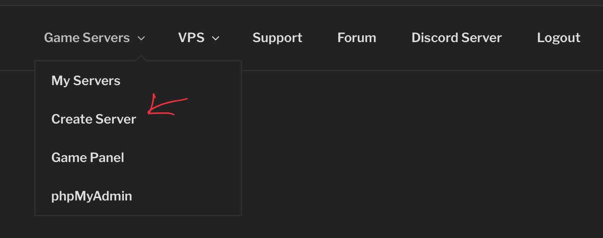
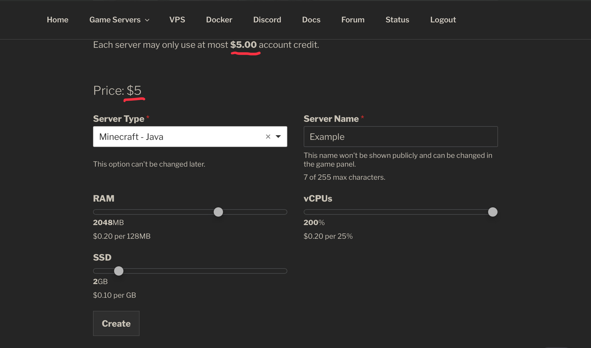
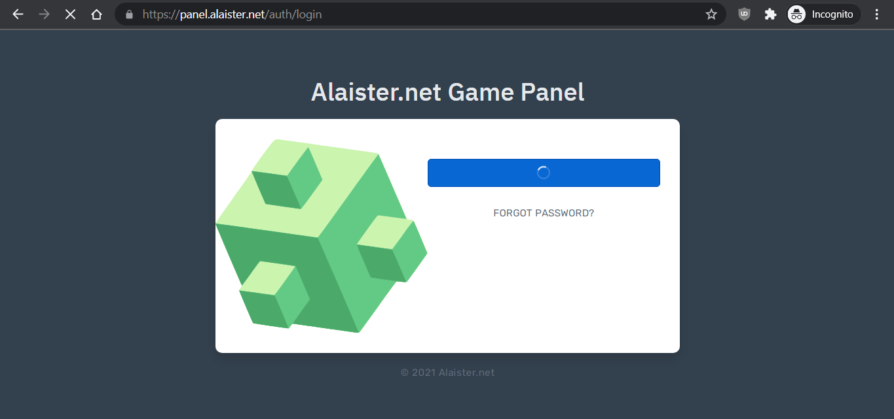
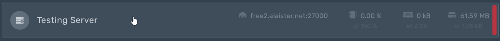

## Sign up for an account
First, create an account in the [client portal](https://client.alaister.net/){:target="_blank"} with your Discord account.

## Create a server
Then, in the client portal, under `Game Servers` click `Create Server` in the header menu.

After that, customize your new server. Below is a standard configuration for Minecraft servers. Click `Create` after editing the config.

## Manage your server
Under `Game Servers` click `My Servers` in the header menu. You can edit/renew your server, **install server JAR and plugins** with our software installer, choose a **subdomain name**, or create a public status page.

!!! info
    Make sure you renew your server every 3 days or they'll be suspended. You just need to execute the `/aservers renew` bot command or click the renew button in the client portal.

## Log into game panel
Finally, log into the [game panel](https://panel.alaister.net){:target="_blank"}. *Again, no password is required :)*

You'll see a list of servers you own or have access to. Click your server to manage it.

## Video by `@FlameFace#0570`
{:target="_blank"}
