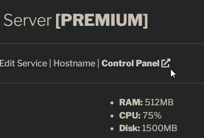

## Sign up for an account
First, create an account in the [client portal](https://client.alaister.net/){:target="_blank"} with your Discord account.

## Create a server
Then, in the client portal, under `Services` click `Order New Services` in the header menu, or through [this link](https://client.alaister.net/account/services/order/){:target="_blank"}.

Next, choose a server type. We're going to create an application server as an example. Remember, **you are not allowed to run a game server in an app server!**

After that, create your new server:

1. Choose the software, e.g. NodeJS.

2. Choose a node available. The list you are seeing may be different from the screenshot below.

3. Edit the resources. Make sure you have enough coins (default is max. **5000 coins**). The below is recommended for most Discord bots and web apps.

## Manage your server
After creating a server successfully, you will be redirected to the server settings. (You can also go to this page by clicking `My Services` under the `Services` menu) Now, you can view, edit, renew, and delete your server.

!!! info "Remember to renew your server!"
    Make sure you renew your server **every 7 days** or they'll be suspended. You just need to execute the `/service renew` Discord bot command or click the renew button in the client portal.

## Control server though the control panel
Finally, access the [control panel](https://panel.alaister.net){:target="_blank"} to manage your server.

## Video by `@FlameFace#0570` (outdated)
{:target="_blank"}
